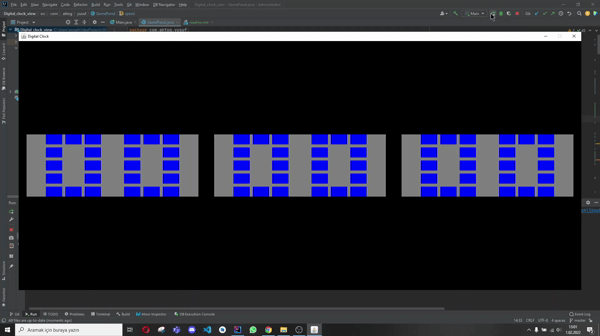

# Digital Clock Representation With Using 5x5 Grid Layout

---

# Summary

### Example

---

#### An example Digit Representation looks like

` zero =  "FTTTF" + "FTFTF" + "FTFTF" + "FTFTF" + "FTTTF" `

- Here, digit zero is represented by 25 (5x5 Grid) cells. The representation string clarifies 
  that whether the corresponding cell is going to be filled or not.
- 5x5 Grid Layout. Digit Representation
- T means TRUE which means that the corresponding cell will be filled.
- F means FALSE which means that the corresponding cell will not be filled.

---

All digits are represented by a string like the example above there are 6 threads for six digits
(00:00:00)

From rightmost digit  to leftmost digit, related threads change the digits every 
1 seconds, 10 seconds, 1 minutes, 10 minutes, 1 hours, 10 hours respectively.

